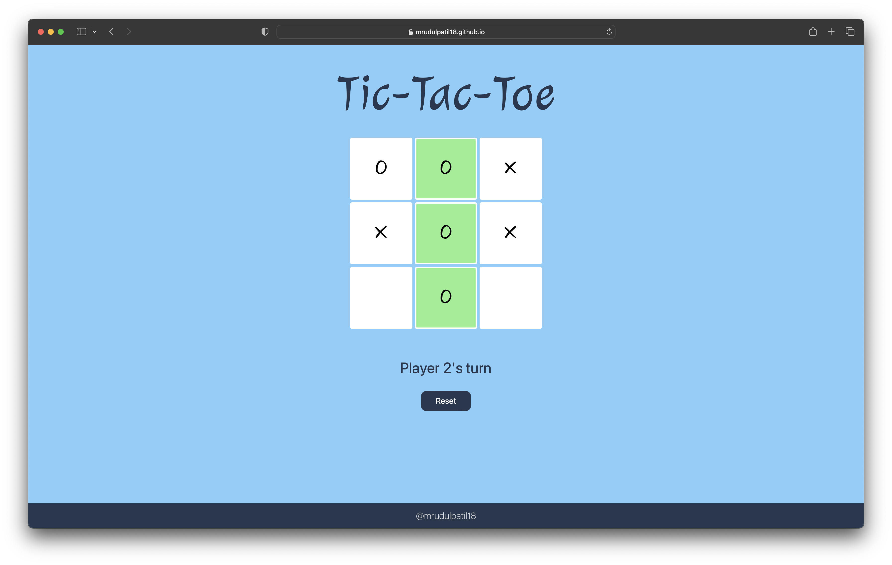

# Tic-Tac-Toe

Small webpage project to practe and implement modules and factory functions (JS) practically. 
Allows two players to play a single instance of classic puzzle game.
It provides a feature to reset the board and provide a winner. 

## Authors

- [@mrudulpatil18](https://www.github.com/mrudulpatil18)

## Screenshot

#

Project is created with reference to the [The Odin Project](https://github.com/TheOdinProject) curriculum.

#